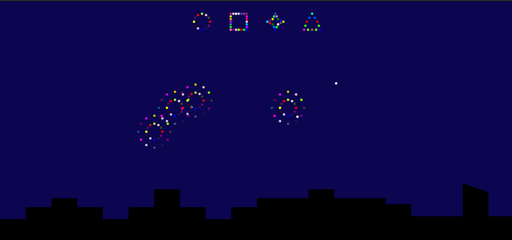

# ⚙ Interactieve vuurwerk show

Dit is de meest recente versie van de show

  

Live project: https://koenhaagsma.github.io/Fireworks/

## 📂 Assignment

Een interactieve vuurwerkshow maken met puur CSS en een interactie die daarbij past. 
[Rubric](https://cmda-minor-web.github.io/css-to-the-rescue-2122/beoordelingsformulier.html)

## 🧾 Table of contents

-   [About the project](##About-the-project)
    -   [Built with](###Built-with)
-   [Progression](##Progression)
-   [License](##License)
-   [Contributers](##Contributers)

## 📖 About the project

Het project dat ik gekozen heb gaat over het maken van een vuurwerkshow in CSS en HTML geen JS! wat erg belangrijk is, het mag alleen gebruikt worden in uitzonderlijke situaties die je sterk moet kunnen onderbouwen.

## 🛠 Built with

De vuurwerkshow is compleet gemaakt met HTML & CSS (Geen JS)

## 👩‍💻 Progression

### Knowledge before starting:

Voordat ik met dit vak startte had ik redelijk wat ervaring met CSS, wel layouts etc. bouwen maar niet met animaties, dus denk dan aan @keyframes, transistions en alles wat bij CSS animations komt kijken.

Daarnaast heb ik ook geen kennis met het aanklikken van buttons etc. en die dan alleen handelen met CSS, normaal doe ik dat met JS omdat het dan voor mij de 'makkelijke' optie is.

Ik had ook nog geen ervaring met custom properties van CSS zelf, ik heb wel gebruikt gemaakt van variabelen in SCSS, later hoorde ik dat CSS custom properties real time aan te passen zijn, de variabelen in SCSS worden geprocessed waardoor ze vast staan en niet meer aan te passen zijn, dit opent erg veel mogelijkheden.
Ik heb hier gebruik van gemaakt door verschillende GATES te tonen te zien in deze [codepen](https://codepen.io/koenhaagsma/pen/WNXjMbz) gemaakt in de introductie.

Ik heb gekozen voor de vuurwerk opdracht, omdat je hierbij het meeste van animations kan gaan gebruiken maar ik denk ook dat het opzich 'basic' genoeg is om mee te starten, daarnaast moet je de vuurwerk show ook interactieve maken daar kan ik dus leren hoe ik bijvoorbeeld buttons laat werken met alleen CSS.

### First version:

In mijn eerste versie ben ik bezig geweest met het uberhaupt proberen om een in dit geval een bolletje omhoog te laten bewegen, direct erachter gekomen dat de assen andersom lopen dan ik dacht. Ook bij de eerste versie voor het eerste gewerkt met het chainen van animaties, deze versie werkt nu alleen nog op refresh, volgende stap is denk ik een knop bouwen en dat dan de animatie afspeelt

Wat ik geleerd heb in de eerste versie:

-   Keyframes gebruikt om te zorgen dat er verschillende transforms achter elkaar worden uitgevoerd en op bepaalde momenten
-   Transformes gebruikt om te zorgen dat de bolletjes omhoog vliegen en dan op een bepaald punt uit elkaar schieten
-   X-Y scale zijn omgedraaid en relatief aan de pagina, daarnaast draaien de scales mee als je iets transformt.

### Second version:

In mijn tweede versie ben ik vooral bezig geweest met het refactoren van mijn code. Dit omdat ik erg veel lines aan code had die op elkaar leken, dus daar was ruimte voor verbetering. Ik dacht daarbij aan variabelen en laat je daar net custom properties voor kunnen gebruiken.

Ik heb ook in de tweede versie andere vormen van de ene vuurbol die ik gemaakt heb gemaakt, andere kleuren andere 'uitschietvorm'.

In de tweede versie ben ik vooral bezig geweest met het refactoren van mijn code, daarom nog steeds hetzelfde resultaat met minder code.

Dit heb ik dus geleerd in mijn tweede versie:

-   Custom properties gebruikt om te zorgen dat code niet opnieuw en opnieuw geschreven hoeft te worden.

Waar loop ik tegenaan:

-   Er zijn dingen die ik niet kan doen in CSS, ik denk dan aan: Randomizen van verschillende custom properties, zodat ik niet heel erg veel CSS hoeft te schrijven om elk verschillend bolletje er goed in te krijgen.
-   Nog steeds teveel code die ik moet herschrijven, misschien is hier een andere manier voor, zo ja dan zal ik die
    uitwerken in [Third version](### Third version).

### Third version:

In de derde versie heb ik sprongen gemaakt, ik realiseerde dat om elke single div(je) te animeren dat is heel veel werk, ik denk dat het uiteindelijk een heel mooi resultaat kan opleveren omdat je echt elke 'pixel' van het vuurwerk dan kan animeren.
Toen ging ik verder zoeken en kwam ik erachter dat ik box shadows kon gaan gebruiken, toen ik daarachter kwam kon ik met 1 single div een heel vuurwerk knal maken, er ging een wereld voor me open en heb me daarbij gefocussed op het maken van verschillende vormpjes om zo box shadows te oefenen.

Daarnaast heb ik mijn vuurwerk interactief gemaakt, ik kwam erachter dat je doormiddel van checked op een label en dan de input hiden, dat je een mooie button kan maken die functioneert als een radio button, ik heb er voor gekozen om m'n buttons de vorm te maken van m'n vuurwerk.

Ook ben ik bezig geweest om m'n project wat aan te kleden, ik heb er voor gekozen om een skyline te maken, hierbij heb ik geprobeerd om het silhouette van een typisch Nederlands dorpje te maken, dus: Kerkje, kantelen etc.
Ik vind dat dit nog wat gedetailleerder kan heb dit alleen nog niet kunnen toepassen, als ik nog meer tijd had had ik graag nog wat raampjes willen toevoegen met mensen erin en die dan ook geanimeerd krijgen

In mijn derde versie is dan ook mijn eindproduct te bewonderen

Dit heb ik kortom gedaan in m'n derde versie:

-   Box shadows gebruikt om te zorgen dat ik niet elk div(je) hoef te animeren;
-   Verschillende vormpjes gemaakt met box shadows;
-   Clip path gebruikt om een silhouette van een typisch Nederlands dorpje te maken;
-   Interactieve knoppen gemaakt om het vuurwerk aan te passen naar verschillende vormpjes.

Waar loop ik nog tegenaan en wat wil ik nog gedaan hebben:

-   Gedetailleerd sihouette van een Nederlands dorpje
-   Meer vuurwerk
-   Realistischer vuurwerk, dus echt dat het goed vervaagd en het veranderen van het omhoog schieten
-   Ik liep er tegen aan dat ik aan het eind pas het animeren goed door kreeg, daarnaast ontdekte ik ook laat de box-shadow optie om vuurwerk te maken.

In de derde versie heb ik dan ook weer erg veel geleerd over voor mij nieuwe CSS technieken zoals: box-shadows, clip-path.

### Fourth version (Herkansing):

De vierde versie van mijn vuurwerkshow komt voort uit het feedback gesprek dat ik heb gehad tijdens de beoordeling. Ik heb die beoordeling helaas niet gehaald en met deze versie probeer ik dat wel te doen.

In de vierde versie heb ik gevarieerd met wat er te zien is, daarmee bedoel ik dat ik verschillende technieken heb gebruikt om vuurwerk te tonen.
Dit had ik al gedaan tijdens het proces bij de versies hiervoor maar het was niet te zien in mijn eindproduct.
Nu heb ik ervoor gezorgd dat, dat wel zo is.

Ik heb namelijk een versie toegevoegd waarin ik gebruik heb gemaakt van div'jes om één bolletje te simuleren, dat betekende dat ik heel veel verschillende selectors moest gebruiken om daartoe te komen.

In deze versie heb ik een een lichte gradient toegevoegd over de achtergrond die wat beweegt, de lucht staat immers nooit stil, de gradient is daarom ook geanimeerd en is lichtelijk te zien.

Tijdens de feedback waren ook de knoppen niet handig om op te klikken, ik heb nu de ::after pseudo-element gebruikt om te zorgen dat er niks aan de knop veranderd maar dat hij wel goed klikbaar is.

Dit heb ik gedaan in m'n vierde versie:

-   Buttons meer accesible gemaakt, het is nu makkelijker om op te klikken;
-   Andere versie van vuurwerk toegevoegd, een versie waarin ik niet gewerkt heb met box-shadows maar met single div'jes die ik appart heb geanimeerd;
-   Achtergrond gradient animatie toegevoegd, omdat de lucht nooit stil staat;

Waar loop ik nog tegenaan en wat wil ik nog gedaan hebben:

-   Ik loop met de single div'jes nog steeds aan tegen dat het heel veel CSS is die telken wordt geschreven, het kan korter en met minder regels maar hier heb ik nog niet echt heel goed naar gekeken.

## 📑 Sources

-   [MDN clip path](https://developer.mozilla.org/en-US/docs/Web/CSS/clip-path)
-   [Clip path generator](https://bennettfeely.com/clippy/)
-   [MDN box shadow](https://developer.mozilla.org/en-US/docs/Web/CSS/box-shadow)
-   [CSS-Tricks box shadow](https://css-tricks.com/snippets/css/css-box-shadow/)
-   [Rubric](https://cmda-minor-web.github.io/css-to-the-rescue-2122/beoordelingsformulier.html)

## 🔖 License

